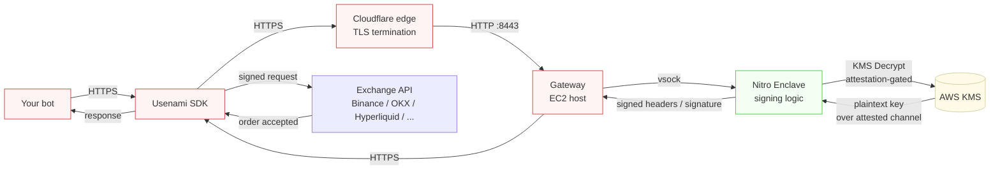
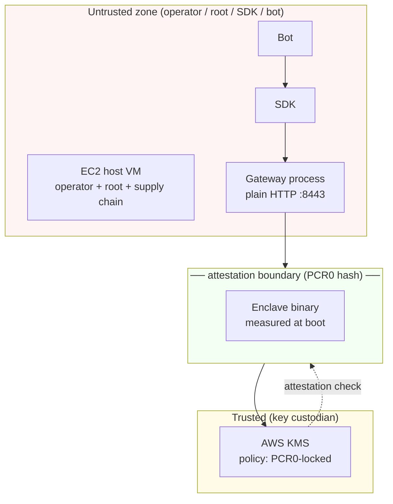

# Architecture

Usenami Signer is a hardware-isolated signing service for crypto exchange APIs. The system is designed so that **exchange API secrets never exist in plaintext outside an AWS Nitro Enclave**, even to a host-root attacker or a compromised KMS operator.

This document describes the runtime data flow, the trust boundaries, and the cryptographic guarantees each component provides.

---

## High-level data flow

**Color legend:**
- 🔴 Red = untrusted boundary (host VM, gateway, SDK, customer bot)
- 🟢 Green = trusted execution environment (the enclave)
- 🟡 Yellow = key custodian (AWS KMS, releases only to attested enclave)

The plaintext exchange API key exists in only one place at one moment: **inside enclave RAM, only for the duration of a single signing operation, then zeroized.**

---

## Trust boundaries

**What this means in practice:**

| Zone | Who has access | What they can do |
|---|---|---|
| Bot / SDK | Customer | Send signing requests, see signed responses |
| Host VM | Operator with root | Read process memory, network traffic, disk — **cannot read enclave RAM** |
| Gateway | Operator | Routes requests; sees ciphertexts, never plaintext key |
| Enclave | Nobody human | Holds plaintext key in RAM only for the duration of one signing operation, then zeroizes |
| KMS | AWS + policy | Decrypts ciphertext only after verifying caller's PCR0 hash matches policy |

The key cryptographic invariant: **a host-root attacker cannot extract the plaintext exchange key.** Nitro hypervisor isolation prevents memory inspection, and KMS will not release the key to any binary except the one whose PCR0 hash is hard-coded in the key policy.

---

## Component responsibilities

### Gateway (`poc/gateway/`)

Lives on the host EC2 instance, serving **plain HTTP on `:8443`** behind a Cloudflare edge that terminates TLS for the public hostname. Authentication is a **bearer token** (`Authorization: Bearer`), not mTLS — there is no client-certificate scheme. Forwards each request to the enclave over `vsock` (the AWS Nitro virtual-socket channel that bypasses the host network stack) and returns the signed payload.

**The gateway never touches plaintext keys.** It handles ciphertext blobs, request routing, rate-limit enforcement, and observability.

### Enclave (`poc/enclave/`)

Rust binary running inside a Nitro Enclave. Boot-measured by the Nitro hypervisor — its hash is published as `PCR0`. Receives encrypted exchange-key blobs (sealed against this specific PCR0), unwraps them via `KMS Decrypt` over the attestation channel, performs the signing operation (HMAC-SHA256 / EIP-712 / etc), zeroizes the plaintext key, returns signed payload.

**Memory hygiene:** all secret material is held in `Zeroize<T>` wrappers, dropped explicitly after use. No disk writes, no swap, no network egress from the enclave.

### Parent helpers (`poc/parent/`)

Systemd integration, `vsock-proxy` for the KMS round-trip, S3 fetch of encrypted blobs at boot. No secret material touches these scripts.

### KMS policies (`poc/policies/`)

The KMS key that wraps the exchange-API secrets has a **resource-based policy** that requires the caller's attestation document to contain a specific `PCR0` value. Anyone calling `kms:Decrypt` from outside the enclave — including the AWS account root — gets `AccessDenied`. Anyone calling from inside a *different* enclave image (PCR0 mismatch) — also `AccessDenied`.

This is what binds the secret to the specific reviewed binary.

---

## Three guarantees, cryptographically enforced

1. **No operator access.** Even root on the host VM cannot read enclave memory. Nitro hypervisor isolation is hardware-enforced, not policy-enforced.

2. **Code integrity.** KMS releases secrets only to a binary whose `PCR0` hash matches the one written into the key policy. Change a single byte of the enclave binary → the hash changes → KMS denies decryption.

3. **Zero plaintext exposure.** Plaintext key exists in enclave RAM only for the duration of a single signing operation. Zeroized on drop. Never written to disk, never sent over network, never visible to the host or gateway.

---

## What this *doesn't* protect against

Honest scope:

- **Enclave logic bugs.** If the enclave binary itself is buggy or backdoored, all bets are off — but anyone can audit it, because the binary that matches the published PCR0 is the only binary KMS will trust.
- **KMS policy mistakes.** A misconfigured policy that doesn't bind to PCR0 defeats the whole model. This is why policies are version-controlled and reviewed (see [`THREAT_MODEL.md`](THREAT_MODEL.md)).
- **Compromised AWS account.** If an attacker gets root in your AWS account and rotates the KMS policy, they can re-bind it to a malicious enclave. Mitigations are documented in the threat model.
- **Customer-side bot compromise.** If the bot is compromised, the attacker can submit valid signing requests. The enclave will sign them. This system protects the *key*, not the request authorization. The **Usenami Policy Layer (UPL) — live in the current build** — bounds a compromised bot to the customer's declared actions, venues, paths, order-size, and transfer-recipient, enforced enclave-side (see [`THREAT_MODEL.md`](THREAT_MODEL.md) A6).

---

## See also

- [`THREAT_MODEL.md`](THREAT_MODEL.md) — formal attacker model and mitigations
- [`CASE_STUDY_PCR0_ROTATION.md`](CASE_STUDY_PCR0_ROTATION.md) — how PCR0 hash rotation works in production (with a real migration example)
- [`DEMO.md`](../DEMO.md) — runnable demo walkthrough
