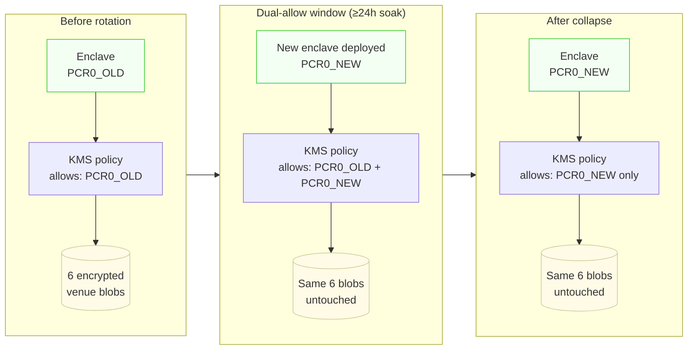

# Case Study: Zero-Downtime PCR0 Rotation Across 6 Live Trading Venues

> **TL;DR.** Every security patch to an AWS Nitro Enclave changes its attestation hash (`PCR0`). Naively, this would mean re-encrypting every key blob on every patch — operationally untenable for a signer that's live against real exchanges. This document describes the rotation pattern this repository uses instead: the encrypted blobs stay untouched, the KMS policy briefly trusts both the old and new PCR0 hashes simultaneously, traffic cuts over, and after a soak window the old hash is removed. Zero plaintext exposure, zero downtime, six live venues. The PCR0 hashes themselves are published to an on-chain registry on Base, so anyone can verify what code is actually running.

---

## Why PCR0 rotation is a recurring operational problem

The threat model in [`THREAT_MODEL.md`](THREAT_MODEL.md) relies on a tight cryptographic binding: the AWS KMS key policy lists the exact `PCR0` measurement of the enclave binary that's allowed to decrypt. Change a byte of that binary, the measurement changes, KMS denies decryption.

Great for security. Operationally, this means **every legitimate change to the enclave is a new measurement**. Examples of changes that have triggered rotations in production:

- `vsock` denial-of-service fix
- `zeroize`-on-drop applied to additional secret types
- `vsock` channel hardening (AEAD-wrapped traffic)
- A new attested `verify-blob` endpoint exposing decryption proof for monitoring

Every one of these is a normal piece of security maintenance — exactly the kind of change you *want* to ship. A signer architecture where shipping a security patch requires also rotating every customer's exchange API key (or, worse, exposing plaintext during migration) is unusable in production. The rotation pattern below is what makes the security model operationally sustainable.

---

## The architectural choice: don't rewrap the blobs

The naive design re-encrypts every key blob against the new PCR0 on every rotation. This means decrypting plaintext somewhere and re-encrypting somewhere — both of which are operational risks if implemented carelessly, and both of which add steps proportional to the number of venues.

This repository's signer takes a cleaner approach: **the encrypted blobs are never touched.** The migration moves only one thing — *which* `PCR0` value the KMS key policy is willing to attest against. One enclave image upgrade, one KMS policy switch, all six venue blobs continue to work without being re-encrypted.

The pattern looks like this:

The encrypted blobs are the same bytes from start to finish. The KMS policy is the only thing that changes — temporarily widening, then narrowing again.

The plaintext key never exists outside an enclave at any point. The "migration" is purely a policy operation.

---

## The 6 venues

At the time of this rotation, the signer was live against:

| Venue | Scheme |
|---|---|
| KuCoin Futures | HMAC-SHA256 |
| Binance | HMAC-SHA256 |
| Bybit V5 | HMAC-SHA256 |
| OKX V5 | HMAC-SHA256 + passphrase |
| Hyperliquid mainnet | EIP-712 (secp256k1) |
| Asterdex (BNB chain) | EIP-712 |

All six venue blobs are sealed against the same enclave PCR0 — there's one enclave image and one KMS key serving all six. The rotation handles all of them in a single coordinated operation, not six.

---

## The 5 steps

### Step 1 — Build and deploy the new enclave image
Build the new enclave binary deterministically (see "What was actually hardest" below — this is non-trivial), compute its `PCR0`, deploy it to its EC2 host. Verify the new enclave is operational with a non-decrypting health check.

### Step 2 — Dual-allow the KMS policy
Update the KMS key policy to accept attestation documents from **either** `PCR0_OLD` **or** `PCR0_NEW`. This is the only window in which the migration is mathematically possible. It's also the moment when the trust surface is at its widest — so it's time-boxed, monitored, and the cutover work is staged to minimize how long the window has to stay open.

### Step 3 — Cut signing traffic over
Route signing requests to the new enclave instead of the old one. All six venues at once — they all share the same blobs, the same KMS key, and now both PCR0s decrypt successfully against the dual-allow policy.

### Step 4 — Soak (≥24 hours)
Production signing runs on the new enclave for at least 24 hours under live traffic. If any venue exhibits an anomaly, the routing can fall back to the old enclave without changing the KMS policy.

### Step 5 — Collapse the policy
After the soak window, remove `PCR0_OLD` from the KMS key policy. Now the policy lists only `PCR0_NEW`. The old enclave binary, if it were still running, would get `AccessDenied` from KMS — and we explicitly verify that it does. The trust surface narrows back to a single PCR0.

---

## Verification — how we prove the migration actually worked

Two layers of verification, both run as part of every rotation:

### Decryption-based verification
We run a `verify-all-blobs` check against all 6 venue blobs. The decryption itself is the proof — KMS will only return plaintext to a caller whose attestation matches an allowed PCR0. If all 6 blobs decrypt successfully under `PCR0_NEW`, the new enclave is correctly attested and bound to the policy. The check is part of the rotation runbook and runs immediately after Step 2 and again after Step 5.

### Live-sign verification
A public endpoint runs the actual signing operation for all 6 venues against the live exchanges. Each venue returns a real signed request that the exchange accepts. If any of the 6 fail, the rotation is aborted and rolled back via the routing layer (the KMS policy still has `PCR0_OLD` in the allowed set during the dual-allow window, so rollback is purely a routing change).

The point of having both layers: decryption proves the *cryptographic binding* is correct; live-sign proves the *signing logic* is correct for each venue's specific scheme. Either one alone would miss a class of failure.

---

## What was actually hardest

Three things, in order of how much engineering effort they actually took.

### 1. Deterministic, reproducible enclave builds

The whole security model depends on the published `PCR0` hash matching the binary that's actually running. That means **two independent builds of the same source code must produce a byte-identical EIF** (Enclave Image File). Otherwise "verify the measurement yourself" is just hand-waving — no two builds would agree on what PCR0 is supposed to be.

Achieving byte-identical builds inside Docker, with the AWS Nitro CLI, across host environments, is *not* the default behavior. It required pinning every dependency, controlling build timestamps, controlling layer ordering, controlling how `cargo` resolves versions. This is the foundational engineering investment that makes the whole rotation pattern verifiable rather than just claimed.

### 2. Encryption-context handling

KMS supports binding ciphertexts to an **encryption context** — extra authenticated data that must match on both encrypt and decrypt. Standard `kmstool-enclave-cli` doesn't expose encryption-context handling end-to-end the way we needed it. We patched `kmstool` to handle encryption-context properly through the attestation channel. Getting this right was subtle and the kind of thing that could fail silently if the patch was wrong.

### 3. The deploy pipeline itself

Coordinating the enclave image build, the EC2 host update, the KMS policy modification, the routing cutover, and the verification checks — across a window that has to stay short — required a deploy pipeline that's idempotent at every step. The pipeline went through several iterations before it was reliable enough to run with confidence on a live signer.

---

## What I'd do differently

Three lessons that have already shaped subsequent rotations:

**On-box hotfixes go straight back to the repository.** During one rotation we made a small fix directly on the running host to unblock the cutover. The next rotation, the fix wasn't in the repository's deterministic build — and produced a different PCR0 than expected. Now: any change touching the enclave goes through the repo first, no exceptions, even under pressure.

**Build determinism is a day-1 requirement, not a day-30 hardening pass.** We treated reproducible builds as something to harden later, and it cost us. The first rotation surfaced reproducibility gaps we then had to fix retroactively. Subsequent versions of similar projects start with build determinism as a hard requirement before any production deployment.

**Publish test vectors.** Anyone forking this repo and running it on their own AWS account is going to face their first PCR0 rotation eventually. We should ship known-good test vectors — sample blobs, sample PCR0 transitions, sample policies — so they can verify their migration end-to-end against a known-good reference, not just hope it works.

---

## Why this is publicly verifiable

The PCR0 hashes the signer uses are written to an **on-chain attestation registry on Base**. The registry's address and ABI are committed in this repository. Anyone — including someone who doesn't trust the maintainers of this project — can:

1. Read the current PCR0 from the on-chain registry
2. Pull this repository at the corresponding commit
3. Rebuild the enclave deterministically
4. Verify their computed PCR0 matches the on-chain value

That chain — *source code → reproducible build → on-chain commitment* — is the strongest form of "trust the measurement, not the operator" we know how to ship today. The rotation pattern documented above is what makes that chain operationally sustainable across the lifetime of a real production system.

---

## See also

- [`ARCHITECTURE.md`](ARCHITECTURE.md) — what PCR0 binding actually does inside the trust boundary
- [`THREAT_MODEL.md`](THREAT_MODEL.md) — why narrowing the policy back to a single PCR0 matters
- [`DEMO.md`](../DEMO.md) — try the signer end-to-end
